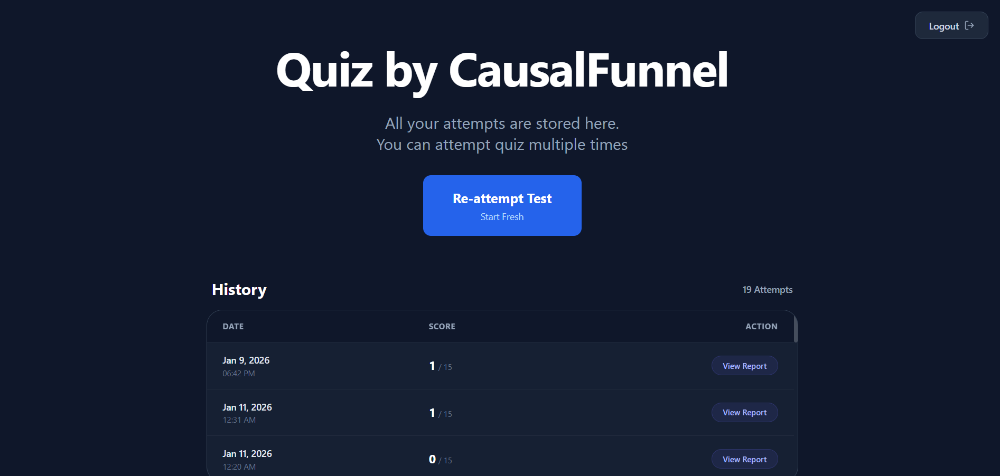
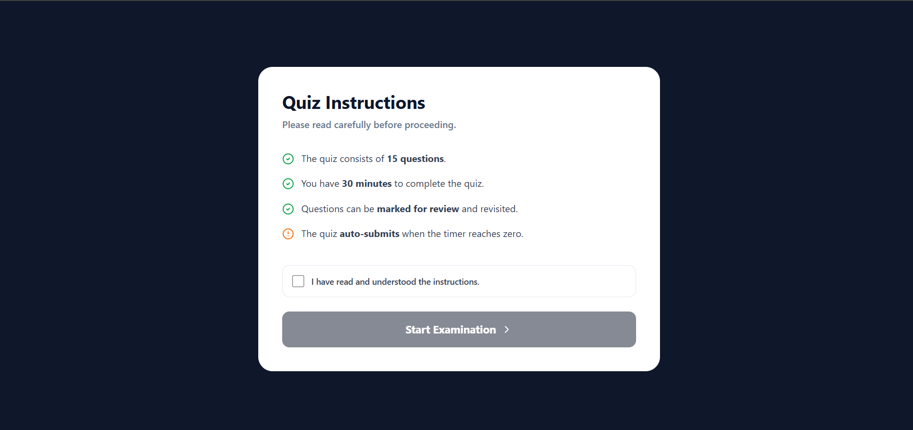
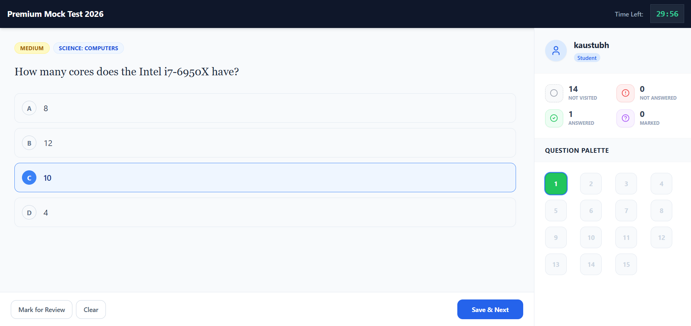
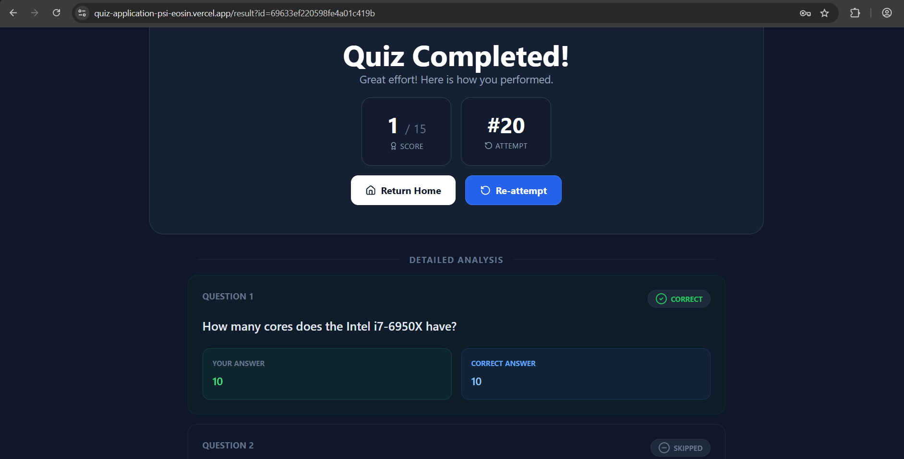

# Quiz Application

## Tech Stack
- Next.js (App Router)
- TypeScript
- Tailwind CSS
- MongoDB
- Custom Authentication (JWT + HttpOnly Cookies)
- OpenTDB API

## Live Demo
[Access Live Application](https://quiz-application-psi-eosin.vercel.app/)

## Screenshots









## Description
A comprehensive full-stack quiz application designed to provide a quiz experience. The application features a secure user authentication system, a responsive test interface with timer functionality, and detailed performance analysis. 
Participants can attempt the quiz multiple times; every single attempt is individually stored and retrievable.

Key features include:
- **User Authentication**: Secure signup and login functionality using JWT and bcrypt.
- **Dynamic Quiz Interface**: Real-time timer, question navigation, mark-for-review capability, and interactive question palette.
- **Result Analysis**: Instant scoring and detailed question-by-question breakdown upon quiz completion.
- **Multi-Attempt Support**: Users can attempt the quiz multiple times; every single attempt is individually stored and retrievable.
- **Responsive Design**: Optimized for both desktop and mobile devices.

## Setup Instructions

### Prerequisites
- Node.js (v18 or higher)
- MongoDB Database (Local or Atlas)

### Installation

1. Clone the repository:
   ```bash
   git clone <repository-url>
   cd quiz
   ```

2. Install dependencies:
   ```bash
   npm install
   ```

3. Configure Environment Variables:
   Create a file named `.env` in the root directory and add the following configuration:

   ```env
   MONGODB_URI=
   OPENTDB_API_URL=https://opentdb.com/api.php?amount=15&type=multiple
   JWT_SECRET=
   ```

4. Run the development server:
   ```bash
   npm run dev
   ```

   The application will be available at `http://localhost:3000`.

### Building for Production

To create a production build:

```bash
npm run build
npm start
```

## Project Structure
- `app/`: Next.js App Router pages and API routes.
- `components/`: Reusable UI components (QuestionCard, OverviewPanel, etc.).
- `context/`: React Context for global state management (QuizContext).
- `lib/`: Utility functions and database connection helpers.
- `types/`: TypeScript definitions.

